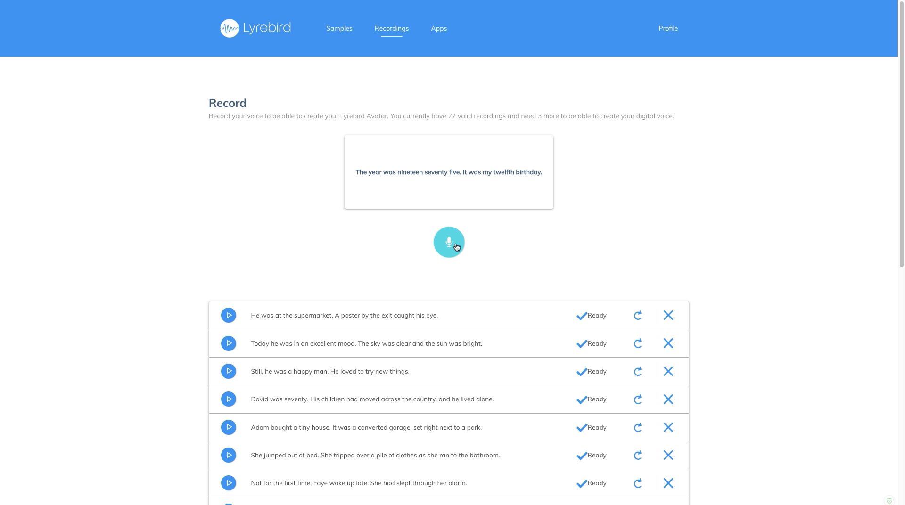

# In-progress Work

* Date: April 4, 2019
* Medium: Video
* Description: Screen recording of submitting my voice sample

[Lyrebird.ai](https://lyrebird.ai) is a service that utilizes the technology of machine learning to sample an individual’s voice and turn it into a Text-To-Speech (TTS) engine. This is a screen recording of me submitting my voice sample through their website. I will be using this TTS engine to create an introductory video of a future consumer product using the technology of machine learning. By using a screen recording to document the progress of my final work, I can clearly show one of the application of this technology, and strengthen the link between my work with my research topic. 