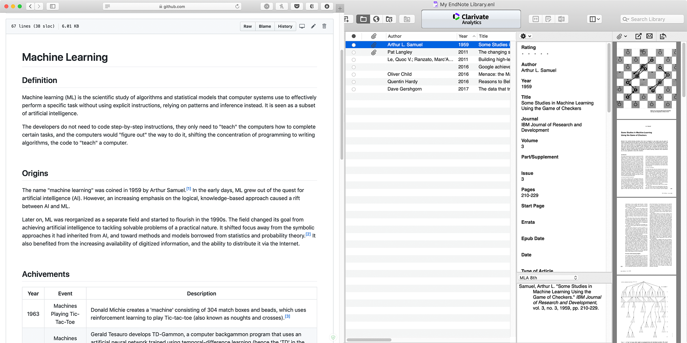

# Research Method

This is a screenshot of my research notes and source manager. 

I utilized markdown as the main format for my research notes and EndNote as a manager for all the sources I collected. With the additional help of git and Github.com, I can keep track of my research progress and backup every changes I made online. By documenting this process using a screenshot can best show the correlation between the notes and sources, as well as between the research methodology and my topic. 